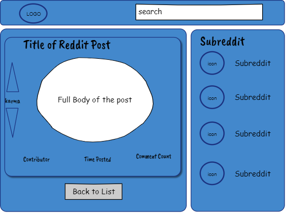

# A Simple Personalized Reddit Feed
I want to grab my account and thin it down to just the basics of what I'm looking for with a navigation bar that lets me choose the subreddit I am interested in based on my current subscriptions.

---------------------
## Technology
- HTML, CSS, Javascript
- React, React-Router, Redux
- Jest, Enzyme
- Reddit API
- Git version management
- Netlify deployment
- CI/CL Management?

-------------------
## Basic Wireframe

## Guide to Functions

- On Load
    - Fetches my subreddit subscriptions and builds nav, then builds post feed based on my home feed.
- Search
    - Searches titles for input and then filters list by those titles.
- Karma and arrows
    - Sends upvotes or downvotes to Reddit.  Number indicates current karma points pulled from Reddit.
- Time Posted
    - Grabs post time from Reddit and then calculates, based on current time, how old the post is.
- Comment Count
    - Displays number of comments on post pulled from Reddit. 
    - onClick - expands and displays comments.
    - (NEED A WIREFRAME)
- Title of Reddit Post
    - onClick expands post to include full body.
    - 
    - Back to List Button returns to previous listed view
- Subreddit and Icon
    - onClick creates to post feed based on chosen subreddit

