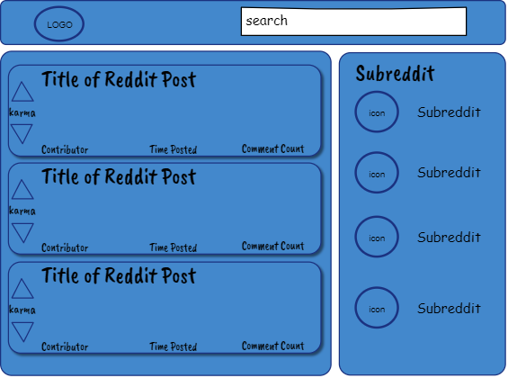

# A Simple Personalized Reddit Feed
I want to grab my account and thin it down to just the basics of what I'm looking for with a navigation bar that lets me choose the subreddit I am interested in based on my current subscriptions.

---------------------
## Technology
- HTML, CSS, Javascript
- React, React-Router, Redux
- Jest, Enzyme
- Reddit API
- Git version management
- Netlify deployment
- CI/CL Management?

-------------------
## Basic Wireframe



## Guide to Functions

- On Load
    - Fetches my subreddit subscriptions and builds nav, then builds post feed based on my home feed.
- Search
    - Searches titles for input and then filters list by those titles.
- Karma and arrows
    - Sends upvotes or downvotes to Reddit.  Number indicates current karma points pulled from Reddit.
- Time Posted
    - Grabs post time from Reddit and then calculates, based on current time, how old the post is.
- Comment Count
    - Displays number of comments on post pulled from Reddit. 
    - onClick - expands and displays comments.
    - 
    - On expansion grabs comment time from Reddit and then calculates, based on current time, how old the post is.
- Title of Reddit Post
    - onClick expands post to include full body.
    - 
    - Back to List Button returns to previous listed view
- Subreddit and Icon
    - onClick creates to post feed based on chosen subreddit


## Setting up the environment
We're gonna set this up with React, React-Router, and Redux.  For testing, we will use Jest and Enzyme.

To create the initial structure for the environment:

````
npx create-react-app personalreddit
````

After entering new directory - personalreddit (Gotta remember that on the git push, need to move back up to personalReddit one level up.):

````
npm install react-router-dom
````
Then add redux:

````
npm install redux react-redux
````

Now to set up Jest.  FIrst we'll install it:

````
npm install --save-dev jest
````
To use it together with Babel, we'll install:

````
npm install --save-dev babel-jest
````

Create a file named <mark style ="background-color: lightgrey">.babelrc</mark> and paste this code:
````
{
    "presets": ["@babel/preset-env"]
}
````
Then add this to <mark style ="background-color: lightgrey">scripts</mark> in <mark style ="background-color: lightgrey">package.json</mark>:

````
{
    ...
    "scripts": {
        ...
        "test": "jest",
        "test:watch": "npm test -- --watch"
    },
    ...
}
````
Need to add Enzyme.  I'll update this when the time comes.